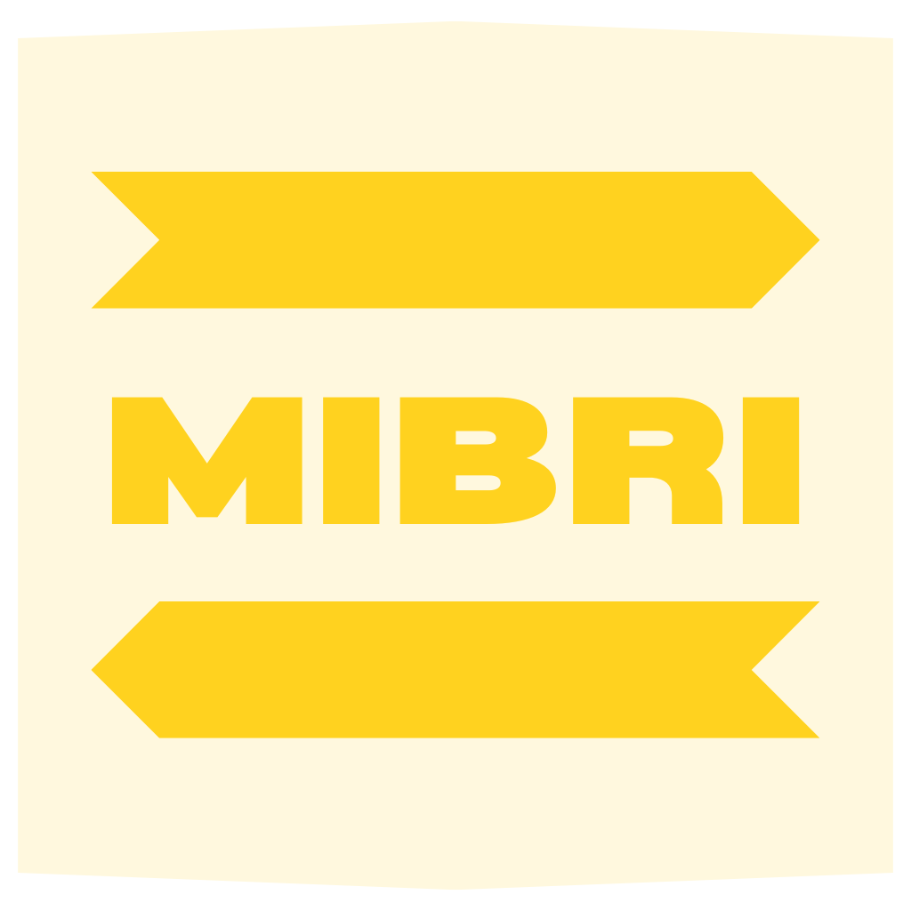

  

---

**MIBRI** is a mobile application that helps users prepare for interviews by generating **AI-powered mock interview questions** based on their resume.

Upload your resume → Get personalized questions → Practice confidently.

---

## ✨ Features

- Upload Resume (PDF)
- AI-generated interview questions
- Multiple interview durations
- Voice-based interaction (planned)

---

## 📱 Tech Stack

### Mobile App
- React Native (Expo)
- TypeScript
- expo-document-picker
- expo-speech
- react-native-voice
- axios

### Backend
- Node.js
- Express.js
- JavaScript
- multer (file uploads)
- pdf-parse (resume parsing)
- dotenv
- cors

### Database & Storage
- Supabase (PostgreSQL + Storage)

### AI Integration
- Mistral (via Hugging Face Inference API)

### Tools
- Postman (API testing)
- Docker

---

## App Screenshots

  

